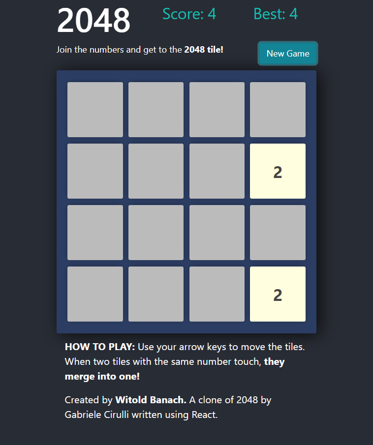

# 2048-game
## Description
A clone of 2048 game, created in django+react

## Installation

#### 1. Clone repository

#### 2. Run command
>pip install django

#### 3. Run command
>python manage.py runserver

#### 4. Open your browser at:
>http://127.0.0.1:8000/

#### Have fun playing the game.
